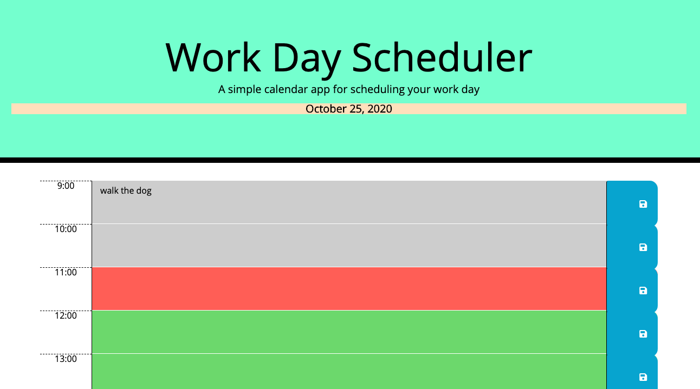

# Work Day Scheduler

I created a simple calendar application that allows a user to save events for each hour of the day by modifying starter code. The HTML and CSS were given but the javascript is original. This app runs in the browser and features dynamically updated HTML and CSS powered by jQuery. This will be a helpful way for the user to organize their day, and store things on their calendar by the hour for a standard business day, 9AM-5PM. There is also conditional logic written into the javascript that displays the times on the calendar in different colors. This was done using the moment.js resource noted below. The hours for the calendar are displayed in military time. The current time will have a red background, the past grey, and the future green.

**_I used the [Moment.js](https://momentjs.com/) library to work with date and time._**

**The following screenshot demonstrates the application functionality:**

**The URL of the functional, deployed application:**

[Day Scheduler] (https://amoseman1.github.io/dayScheduler/)
